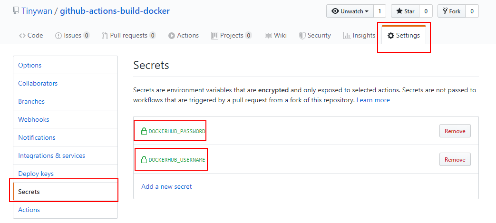
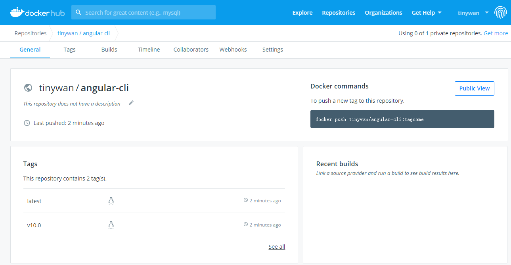

[]()

This article will help you to set up a workflow with GitHub actions that will build and tag the Docker image and push it to the Docker Hub registry.

## Creating the Repo
Let’s start by creating a new GitHub repo that will hold our code (in our case, really only a Dockerfile is needed) for building the image. Create the repo in GitHub, and name it whatever you want. Add one file in the root of the repo, called Dockerfile. If you’re following along with me, you’ll be building an image that has the Angular CLI baked in to it. If you need a different image, then change the following to match your needs. The contents of the Dockerfile should be:

```docker
# ./Dockerfile

FROM node:12-alpine as node-angular-cli

LABEL authors="Tinywan"

# Linux setup
# I got this from another, deprecated Angular CLI image.
# I trust that developer, so I continued to use this, but you
# can leave it out if you want.
RUN apk update \
  && apk add --update alpine-sdk \
  && apk del alpine-sdk \
  && rm -rf /tmp/* /var/cache/apk/* *.tar.gz ~/.npm \
  && npm cache verify \
  && sed -i -e "s/bin\/ash/bin\/sh/" /etc/passwd

# Angular CLI
RUN npm install -g @angular/cli@8
```

## Creating the GitHub Action

So to get started with your GitHub action, click on the “Actions” tab on your repo’s page in GitHub:  


You should now see a landing page that looks similar to this:  


This step logs us in to the Docker Hub Registry. We output the password and then pipe that in to the docker login command. There is something new here, though, and that’s the secrets that we are using. GitHub has a section in the settings for each repository where you can set up secrets to be used for things like the GitHub Actions. It’s great, because otherwise there would be no way to log in to third party services like Docker Hub without putting your password or access key in to the repo, visible for everyone to see. To find the secrets, click on Settings at the top of the repo, then Secrets in the left nav list, and then add the secrets that you need, in this case our username and password for Docker Hub:  

  

## Tagging and Releasing

This last step is tagging a release in our GitHub repo. This will kick off a build for our workflow. To do this, click on the releases section of your repo, which is under the Code tab:  

  

Click on the “Draft a new release” button. GitHub will walk you through the steps of creating the release, but you should choose a tag name and the desired commit to release. You can add a title and a description as well. Remember two things: the tag name you use here will be used as the tag name for your Docker image, and once you click the “Publish release” button, the workflow will be started. Once you’re ready, publish the release!  

## Viewing the Workflow Output  

To view what happened in your workflow, and to debug if needed, go back to the Actions tab in your repo. Once you’ve created an action, that page will look like this:  

  

In addition to the output of your workflow in the Actions tab, don’t forget to go to Docker Hub and view your image there as well!

  

[more info](https://www.prestonlamb.com/blog/creating-a-docker-image-with-github-actions?from=singlemessage)
